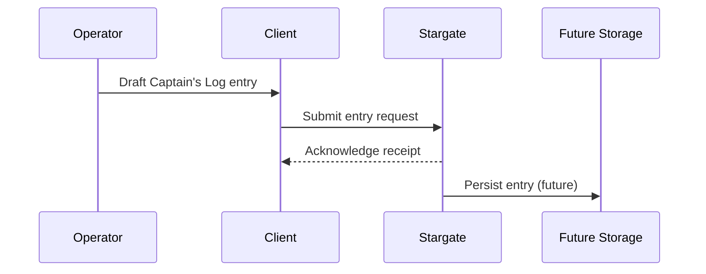

# Captain's Log Guidelines

Mission controllers requested a shared Navigation Log Book ("Captain's Log") to chronicle key events, anomalies, and operator observations. While long-term persistence is a future enhancement, this proof of concept defines how the log will integrate with the telemetry stack.

## Purpose

* Capture human context around telemetry spikes or subsystem state changes.
* Provide a chronological narrative for flight directors and tourists alike.
* Supply Stargate with metadata it can attach to outgoing telemetry or archival stores later on.

## Workflow

1. The telemetry client exposes an option for operators to draft log entries alongside live telemetry monitoring.
2. Entries are submitted to Stargate over a lightweight gRPC method (to be implemented) so the service can validate and persist them.
3. Once the telemetry gateway comes online, it may contribute automated log messages (e.g., hardware failovers) through the same interface.

## Data contract (draft)

| Field | Type | Notes |
|-------|------|-------|
| `entry_id` | UUID | Assigned by Stargate |
| `spacecraft_id` | string | Optional filter aligning with telemetry stream |
| `timestamp_ms` | int64 | Submission time in milliseconds |
| `author` | string | Operator or automated system name |
| `summary` | string | Short description shown in dashboards |
| `details` | string | Rich text or markdown for full context |

The final implementation will depend on the storage target selected during the next project phase, but these guidelines keep all stakeholders aligned on the expected flow today.
